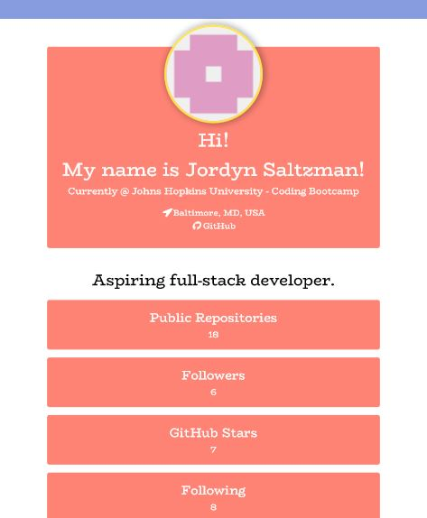

# Developer Profile Generator
A simple command-line application that takes a Github username and favorite color, and dynamically generates a PDF user profile.

## Screenshot

## Description

When preparing a report for stakeholders, it is important to have up-to-date information about members of the development team. Rather than navigating to each team member's GitHub profile, a command-line application will allow for quick and easy generation of profiles in PDF format.

The PDF user profile contains the following:

* Profile image
* GitHub User name
* Links to the following:
* User location via Google Maps
* User GitHub profile
* User blog
* User bio
* Number of public repositories
* Number of followers
* Number of GitHub stars
* Number of users following

## User Story

`AS A product manager

I WANT a developer profile generator

SO THAT I can easily prepare reports for stakeholders`

## License 

MIT License

Copyright (c) 2019 Jordyn Saltzman

Permission is hereby granted, free of charge, to any person obtaining a copy of this software and associated documentation files (the "Software"), to deal in the Software without restriction, including without limitation the rights to use, copy, modify, merge, publish, distribute, sublicense, and/or sell copies of the Software, and to permit persons to whom the Software is furnished to do so, subject to the following conditions:

The above copyright notice and this permission notice shall be included in all copies or substantial portions of the Software.

THE SOFTWARE IS PROVIDED "AS IS", WITHOUT WARRANTY OF ANY KIND, EXPRESS OR IMPLIED, INCLUDING BUT NOT LIMITED TO THE WARRANTIES OF MERCHANTABILITY, FITNESS FOR A PARTICULAR PURPOSE AND NONINFRINGEMENT. IN NO EVENT SHALL THE AUTHORS OR COPYRIGHT HOLDERS BE LIABLE FOR ANY CLAIM, DAMAGES OR OTHER LIABILITY, WHETHER IN AN ACTION OF CONTRACT, TORT OR OTHERWISE, ARISING FROM, OUT OF OR IN CONNECTION WITH THE SOFTWARE OR THE USE OR OTHER DEALINGS IN THE SOFTWARE.